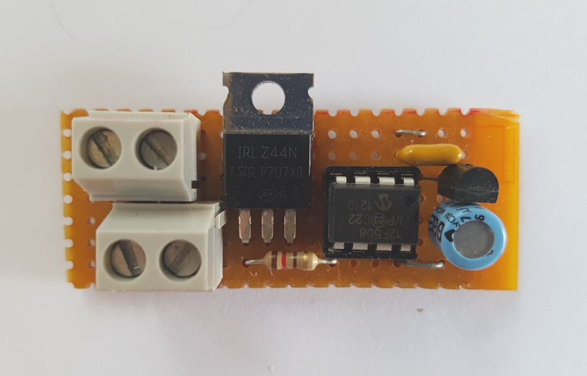

# CandleFlameSim
Candle flame/flicker simulator based on PIC Microcontroller

*Driving a logic level FET via 1K resistor - used with a 12V 20/50W halogen lamp or 55W car headlamp bulb for stage effects (fireplaces etc.)*

The FET barely gets warm with a 4.5A load so no heatsink is required.

'Transistor' on the right is a 5V (78L05) voltage regulator for the PIC.
